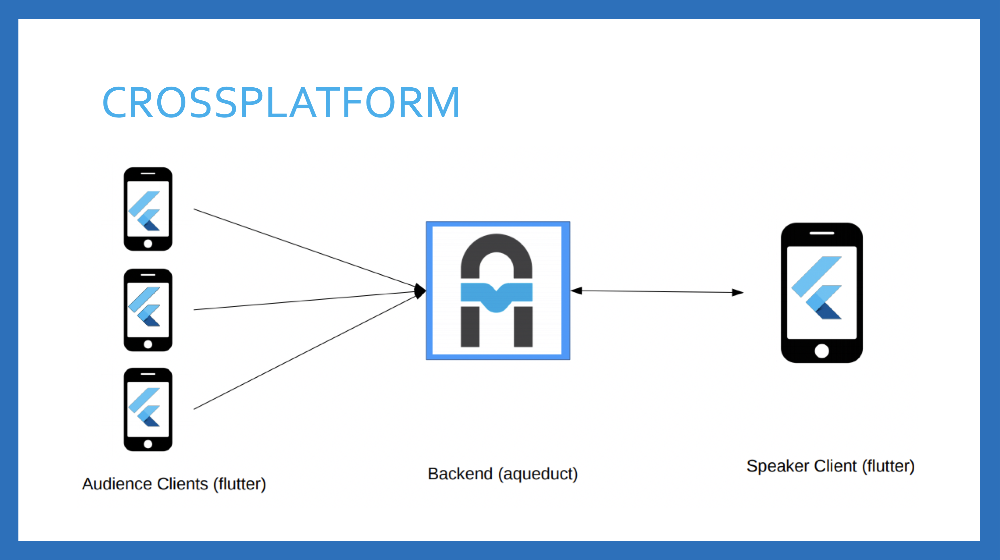

# Studocracy
<i>Get feedback from your audience! </i> 

 

# Purpose
This app is primarily aimed at students, who want to give real time feedback to the professor.
This way the professors can adjust their lectures to the need of the audience, like:
* speak slower
* explain again
* give more details on a topic

The app is also presents a good opportunity for the students who are shy to ask a question or simply don't want to shout across the lecture hall.

The backend was built with Aqueduct and can be found here:
https://github.com/hlnstepanova/studocracy-backend

